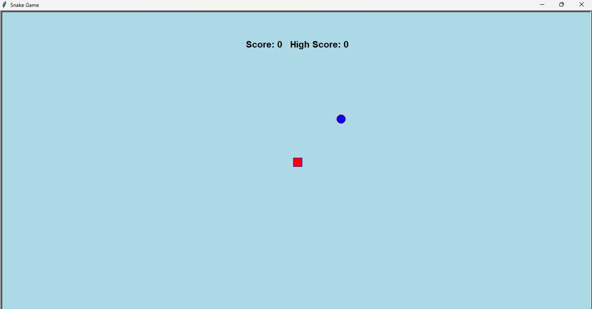
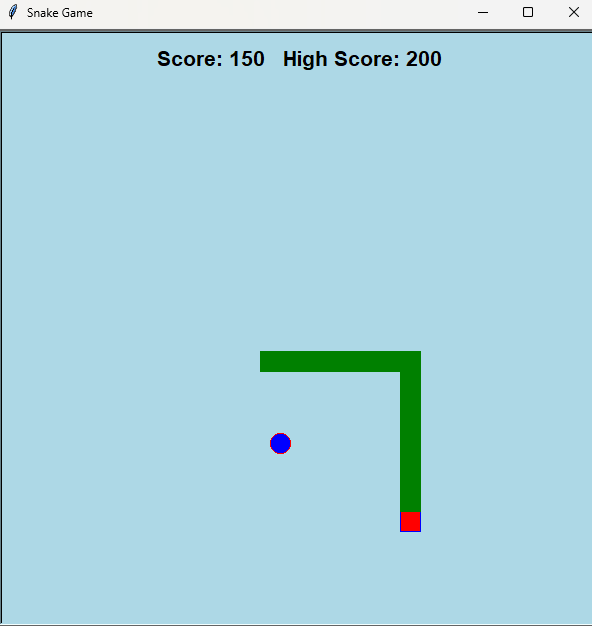

# 🐍 Snake Game in Python


A classic **Snake Game** developed using **Python Turtle Graphics**. The game includes smooth snake movement, score tracking, high score management, snake growth, border wrapping, and self-collision detection.

---

# 📸 Screenshots

## 🏁 Game Start



---

## 🎮 Gameplay



---

# ✨ Features

- 🎮 Snake movement using Arrow Keys
- 🍎 Random Food Generation
- 📈 Live Score Counter
- 🏆 High Score Tracking
- 🐍 Snake Body Growth
- 🚧 Border Wrapping
- 💥 Self Collision Detection
- ⏸ Pause Game using Space Key

---

# 🛠 Tech Stack

- Python
- Turtle
- Random
- Time

---

# 🎮 Controls

| Key | Action |
|------|--------|
| ⬆ Up Arrow | Move Up |
| ⬇ Down Arrow | Move Down |
| ⬅ Left Arrow | Move Left |
| ➡ Right Arrow | Move Right |
| Space | Pause |

---

# 📂 Project Structure

```
Snake_Game
│
├── snake_game.py
├── README.md
├── images
│     ├── start.png
│     └── gameplay.png
```

---

# 🚀 Installation

Clone the repository

```bash
git clone https://github.com/Vinay1213143/Snake_Game.git
```

Go to project folder

```bash
cd Snake_Game
```

Run the project

```bash
python snake_game.py
```

---

# 💡 Future Improvements

- 🔊 Sound Effects
- 🎵 Background Music
- 🎯 Difficulty Levels
- 🚧 Obstacles
- 💀 Better Game Over Screen
- 🔄 Restart Button
- 🎨 Multiple Themes

---

# 🧠 Concepts Used

- Object-Oriented Programming
- Functions
- Event Handling
- Keyboard Binding
- Collision Detection
- Loops
- Random Module
- Turtle Graphics
- Score Management

---

# 👨‍💻 Author

**Vinay Awari**

🔗 GitHub

https://github.com/Vinay1213143

🔗 LinkedIn

https://www.linkedin.com/in/vinay-awari-6795792a4

---

## ⭐ If you like this project, don't forget to Star this repository!
